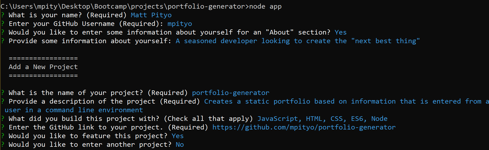

# Portfolio Generator

Create a readable Portfolio based on information entered through a command prompt. Using Node.js and the inquirer package, easily input your information and remove the hassle of needing to style and create the HTML page yourself.
<br>

## 🚚 Getting it up and running
1. Clone the codebase from the [repo](https://github.com/mpityo/portfolio-generator).
2. Query to the root file directory in any command prompt
3. Run the following command to install required packages:
```
npm install
```
4. Run app through node and fill out required sections:
```
node app.js
```
HTML file will be created in the <heavy>./dist/</heavy> directory

## :memo: Features
 - Lightweight and responsive
 - Able to run on any command prompt and any system
 - List of projects changes based on what you decide to feature
 - CSS is easily modifiable before or after HTML file is created
 - Font Awesome and Google Fonts is integrated to give you even more creative powers
 
## :trophy: Credit
Full Javascript/Node by @UCFBootCamp
<br>
Put together and published by yours truly, @mpityo
<br>
<br>
Project is fully open source: explore the code and upgrade away!
<br>
<br>


<br>

